# Process Monitoring: A Hands-On Friction Log

*New Relic vs. an OpenTelemetry + Prometheus/Grafana stack, on a real AWS deployment.*

This is a field log from actually deploying a small production-shaped stack on AWS and
instrumenting it two ways — once with New Relic, once with OpenTelemetry + Prometheus/Grafana —
to find out why host and process monitoring is so widely under-adopted. Every friction point
below was hit live; the screenshots are from the real account.

---

## 1. The short version

Process monitoring isn't under-adopted because the data is missing. It's under-adopted because
the operators who *do* try it hit a wall of **silent, healthy-looking failures** between
"install the agent" and "trust the alert." Nothing errors. The Processes tab is just empty, the
alert just never fires, the page just never gets sent — and the operator quietly stops expanding
coverage.

I hit **four silent failures in a row** before I had a single trustworthy process alert, plus
a fifth at the very end where every alert in the account was firing into a void. None of them
produced an error message. The tools whose entire job is to make failure visible were
themselves failing silently during setup.

The thesis: **adoption rises when the default (automated) path surfaces named processes linked
to their services with zero flag-hunting, when the tool announces its own gaps instead of
failing silent, when the business-critical processes are derived from the user journey rather
than CPU rank, and when alerts can be rehearsed instead of merely hoped for.** The newer
entrants winning on time-to-value (Netdata, Coroot, Causely) compete by *removing decisions*,
not adding data.

---

## 2. What I deployed

A small but production-shaped stack on an AWS free-tier EC2 box, instrumented twice in parallel
so the comparison runs on identical real data:

- **App:** a FastAPI service (`nr-sandbox`) + Redis + a background worker (`nr-sandbox-worker`,
  an async job queue, payment-adjacent), with a Locust load generator producing real traffic —
  slow endpoints, errors, and queue load.
- **Stack A — New Relic:** Infrastructure agent + Python APM agent.
- **Stack B — OSS:** OpenTelemetry Collector → Prometheus/Grafana, with Tempo for traces.
- **The deliberate failure:** I stopped the worker (`systemctl stop nr-sandbox-worker`) to
  reproduce the prompt's "invisible until they crash" scenario and see what each stack caught.

---

## 3. The journey, in five phases

This follows the real order an operator hits friction, from "I want to monitor this box" to
"I have actionable process-level observability."

### Phase 1 — Choosing how to onboard

The fastest question — *what's the quickest path to process visibility on this EC2 box?* — has
a fragmented answer, and the most discoverable path is the wrong one.

The path that *looks* right is **Infrastructure → AWS → connect account**, which wires up
CloudWatch Metric Streams. It yields EC2-level hypervisor metrics (CPU, network, disk) but
**no per-process data whatsoever** — and the UI never says so.

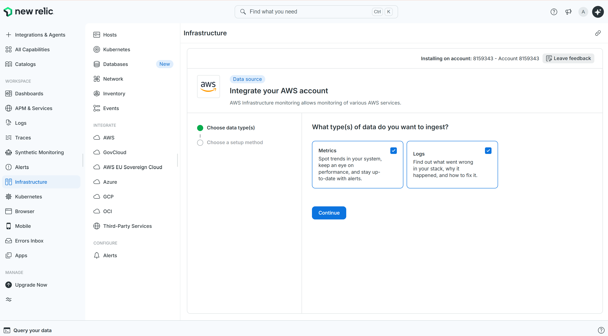

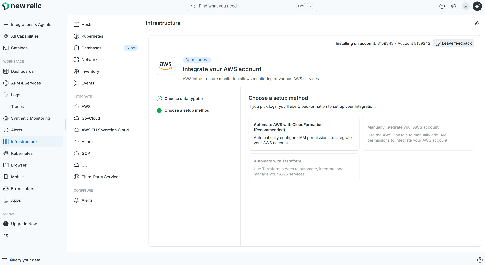

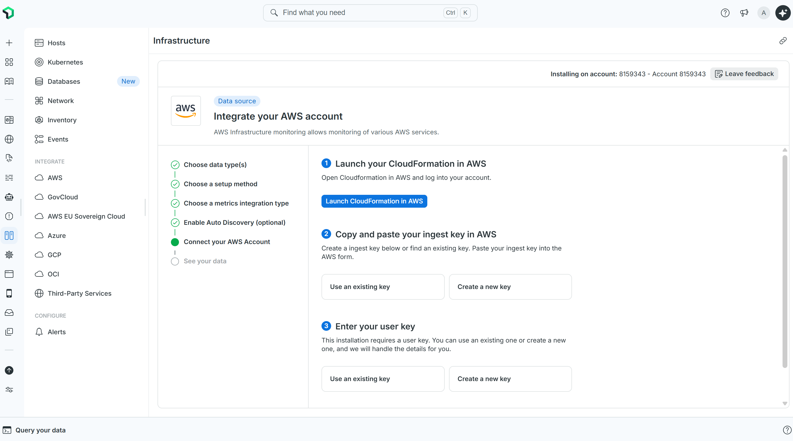

I actually launched the CloudFormation flow — six attempts, four distinct failure modes — and
**every single one was silent in New Relic.** The UI showed "See your data shortly" after each
attempt; the failures were only visible in the AWS CloudFormation console.

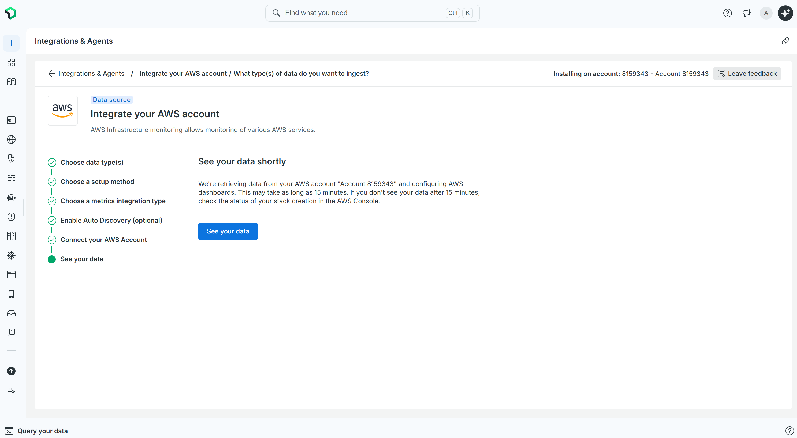

| Attempt | AWS Region | Root cause (found only in AWS console) |
|---|---|---|
| 1 | ap-south-2 | Kinesis Data Firehose not available in region |
| 2 | eu-north-1 | Wizard hardcoded `NewRelicRegion=US` despite an EU account |
| 3 | us-east-1 | Same hardcoded US default |
| 4 | us-east-1 (EU fixed) | Default S3 bucket names already owned by another account globally |

The actual root cause, found on attempt 6: **Kinesis Data Firehose requires an account-level
opt-in this account didn't have.** Every Firehose failure traced back to that one blocker; the
region and bucket-name errors were red herrings from CloudFormation's partial-failure output.
The wizard performs *zero* preflight checks — it launches the stack and lets it fail.

> **Takeaway:** the most discoverable onboarding path omits the most relevant capability
> (processes), and is also the most opaque when it breaks.

### Phase 2 — Installing the agent + collector

Three components installed, three quiet problems.

The **New Relic Infrastructure agent** installed cleanly in one command, but the Processes tab
loaded empty. No error. The fix was a single config flag, `enable_process_metrics: true` — not
in the default config, not surfaced anywhere in the UI, and not mentioned during install. The
*guided* install enables it automatically; the realistic production path (IaC / script /
Ansible) does not.

The **Python APM agent** (`newrelic.admin run-program uvicorn ...`) ran from day one with no
error and produced **zero** APM data. There was no `newrelic.ini` and no `NEW_RELIC_CONFIG_FILE`
set — and the wrapper passes through silently to the underlying process without instrumenting it.
(`newrelic-admin validate-config` would have caught it, but you have to know it exists.)

For **OpenTelemetry**, I shipped `otelcol-contrib` — the distro every getting-started guide
shows, and the one Datadog itself describes as "used in nearly every demo... but not actually
recommended for production." New Relic's own production distro (NRDOT) exists but isn't surfaced
in the guides; you have to know to go looking. *(Cross-check: NRDOT v1.16.0 also ships with
process metrics off by default — "disabled by default due to their high cardinality" — so the
default-off behavior is platform-wide, not a quirk of the infra agent.)*

A note on **cost**, because it's the real reason for the silent default: New Relic's docs call
process samples "the single most high-volume source of data from the infrastructure agent." The
off-by-default behavior is deliberate bill protection — which is defensible. The friction is
*resolving that tradeoff silently* instead of surfacing it as a choice at install time.

The contrast with the guided install is stark — it's a different product tier, not just a
convenience wrapper:

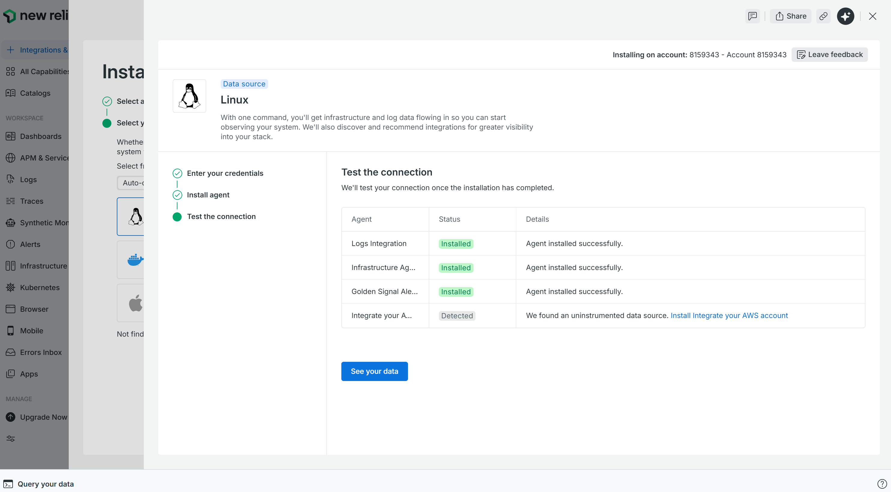

…and it even auto-creates four alert conditions — but **none of them cover process absence**:

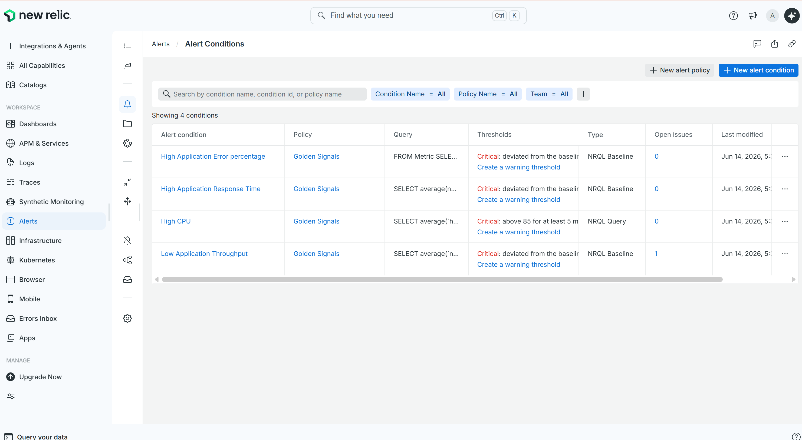

> **Count at end of Phase 2: four silent failures, zero error messages.**

### Phase 3 — Seeing the processes

Once the flag was on, New Relic's Processes tab was genuinely good — named, attributed
processes with zero further config:

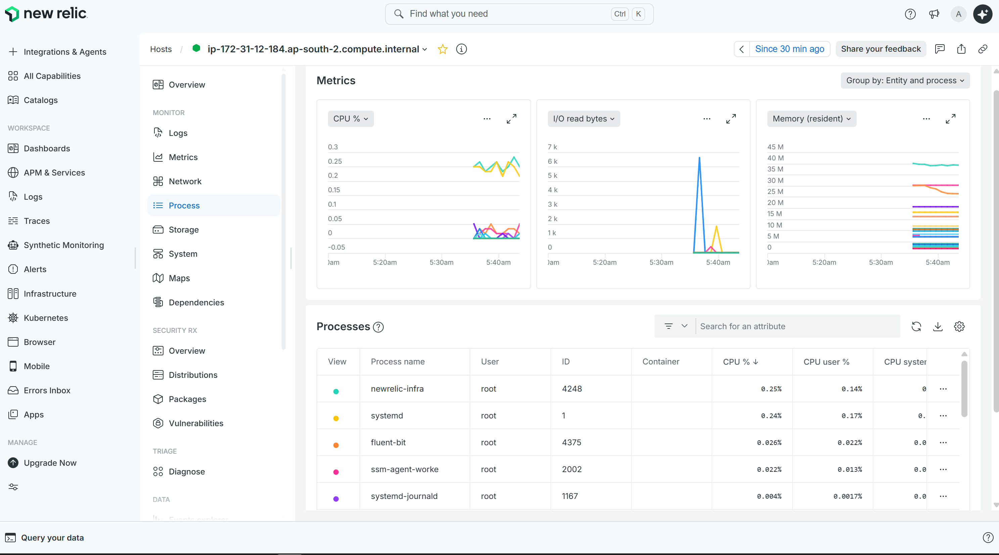

Under load it showed 62 named processes, immediately actionable:

| Process | CPU% | Note |
|---|---|---|
| nr-sandbox | 114.08% | FastAPI app under load |
| redis6 | 8.85% | Handling all reads |
| **nr-sandbox-worker** | **0.037%** | The payment-adjacent worker — at **position 7, off-screen** |

On the OTel side this was worse: Grafana returned process metrics, but
`process_executable_name` was absent from every label, because `mute_process_exe_error: true`
in the collector config silenced the label-drop warning. The result: aggregate process CPU
exists, but *identity* doesn't — "your processes collectively used X seconds of CPU" instead of
"nr-sandbox used 114%." One is useful in an incident; the other isn't. *(This one is on me — I
set that flag, following common advice to reduce log spam. The point is that the recommended
flag silently drops identity, and the tradeoff is never surfaced.)*

### Phase 4 — Making it actionable

The worker ran for 2.5 hours using 4.17 seconds of CPU total. At 0.037% it sorted to position 7
— off-screen by default. When I stopped it, the visible area of the Processes tab showed no
change. The host looked healthy. The API kept serving. Nothing indicated a background component
had died.

Then I tried to build the alert that should have caught it — and walked into three more traps.

**Trap 1 — the guided path dead-ends.** Alerts → guided mode offers a "Process" signal
category, which is exactly where you'd go to alert on a process:

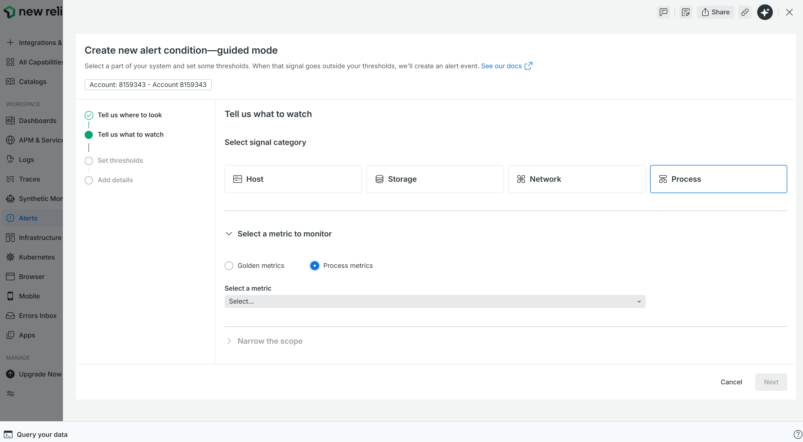

…but the only metric it offers is `timestamp` — a metadata field you can't meaningfully
threshold on. "Golden metrics" is greyed out for processes entirely:

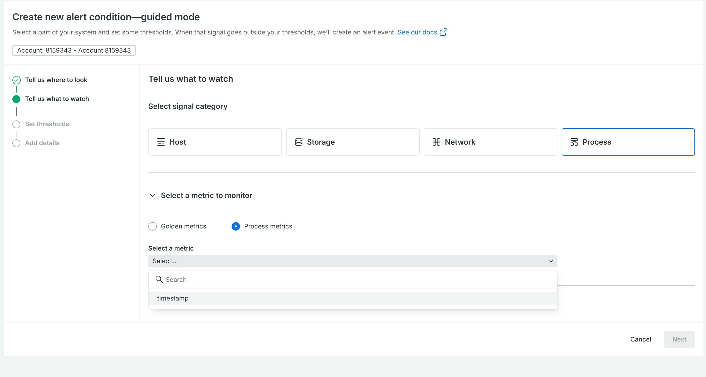

The frustrating part: New Relic *has* a purpose-built **"Process running"** condition type that
is excellent — but it's reachable only via Infrastructure → host → alert button, not from the
main Alerts wizard, and not from the process row's context menu:

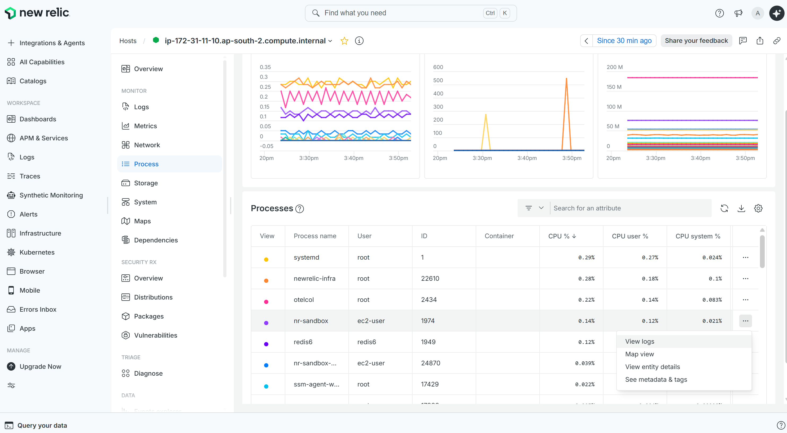

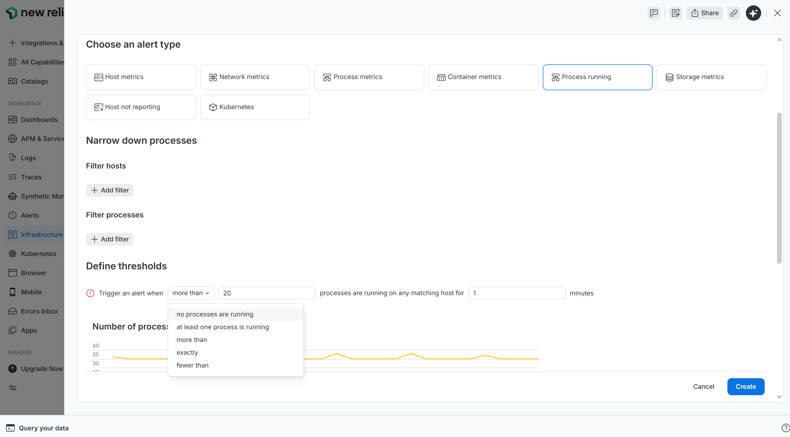

This is a **discoverability gap, not a missing feature.** An operator who can't find what they
need in the guided path falls back to NRQL — and into the next trap.

**Trap 2 — the streaming-gap footgun.** The natural query
(`ProcessSample ... HAVING uniqueCount(processId) = 0`) silently stops evaluating the moment the
process disappears: on New Relic's streaming platform, a gap in data emits *no* event, so no `0`
is ever inserted. The alert goes quiet at exactly the moment it should fire. I confirmed this
live — worker dead for 10+ minutes, condition page completely normal, zero incidents:

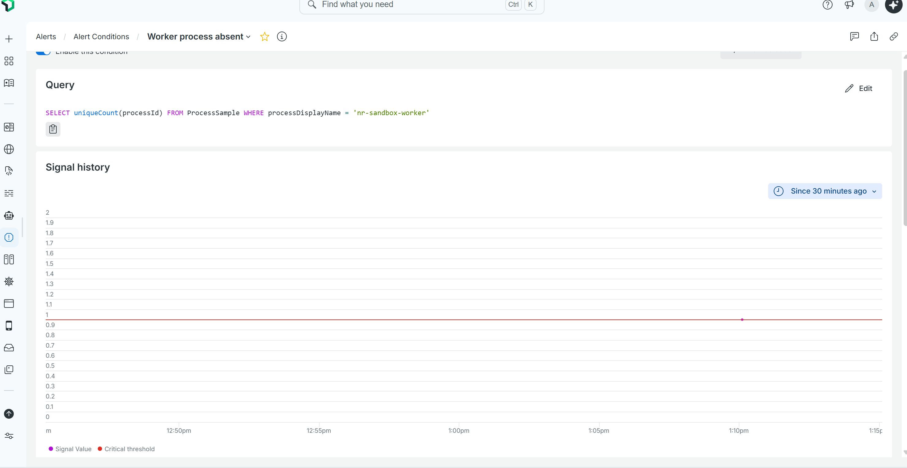

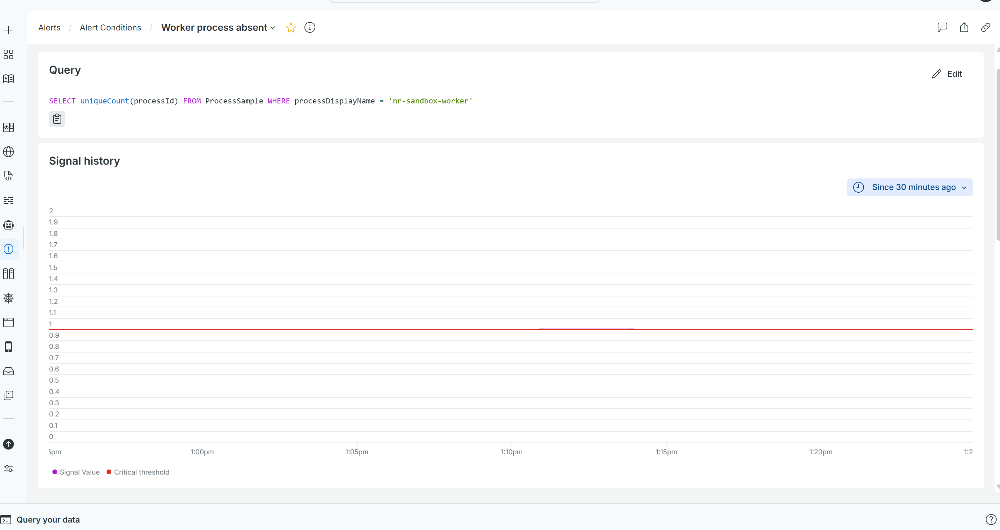

```
SELECT count(*) FROM NrAiIncident WHERE conditionName = 'Worker process absent' SINCE 30 minutes ago
→ count: 0
```

The fix exists — "Add lost signal threshold" — but nothing in the UI prompts for it.

**Trap 3 — the wrong attribute.** `commandName` is the truncated binary name (`python3.11`);
`processDisplayName` is the service name (`nr-sandbox-worker`). Filtering on the wrong one means
the condition never establishes a baseline — no signal, no firing, no error. (New Relic also
truncates `commandName` to 15 characters with no documented warning.)

### Phase 5 — Getting notified (the fifth silent failure)

After building the condition and the policy, I assumed I was covered. I wasn't:

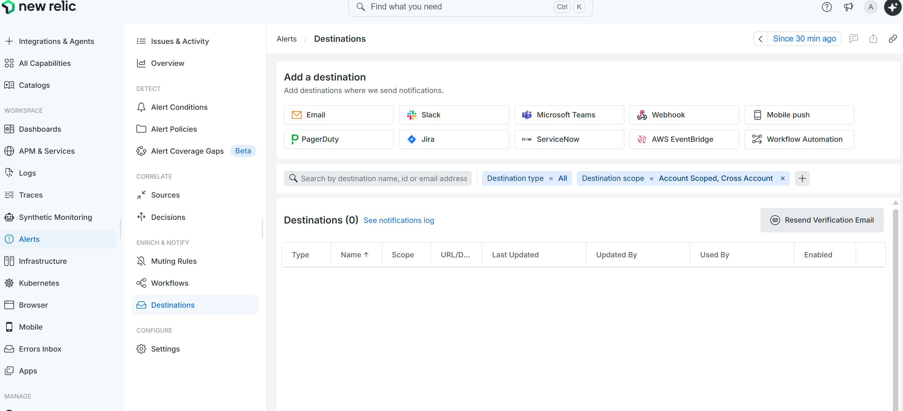

Alert conditions and notification destinations are two separate flows, and **nothing connects
them.** The wizard never mentions destinations; the guided install created conditions but no
destination. An operator who completes every flow in the product ends up with zero coverage and
no indication of it. This is the sharpest finding in the build — the most unexpected, and the
highest real-world risk.

---

## 4. Friction log

Ordered by the phase an operator hits them. "Silent" = produced a healthy-looking state with no
error.

| ID | Phase | What I expected | What happened | Silent? | Severity |
|----|-------|-----------------|---------------|---------|----------|
| **D** | Onboard | Process visibility from the AWS integration | CloudWatch/hypervisor metrics only; empty Processes tab; six CloudFormation attempts, all failing silently in NR | Yes | High |
| **A** | Install | Processes populated after agent install | Empty tab; `enable_process_metrics` off by default for automated installs, no UI surface, no prompt | Yes | High |
| **G** | Install | Informed choice on process metrics + cost | Cost-vs-visibility tradeoff silently resolved toward "off"; never surfaced | Yes | Medium |
| **B** | Install | APM traces from the wrapper | Zero APM data; wrapper is a silent pass-through with no config file *(self-inflicted, but the product should warn)* | Yes | High |
| **E** | Install | A production-suitable collector | Shipped `otelcol-contrib` (the demo distro); NRDOT exists but isn't surfaced *(discoverability)* | No (easy to miss) | Medium |
| **C** | See processes | Named process metrics in Grafana | Identity absent; `mute_process_exe_error` silently drops the label *(self-inflicted; recommended flag, hidden tradeoff)* | Yes | Medium |
| **F2** | Alert | Alert on process absence via guided mode | Guided mode dead-ends at `timestamp`; the native "Process running" condition exists but is unreachable from the wizard | Yes | High |
| **F3** | Alert | NRQL filtered to the right process | `commandName` (truncated binary) ≠ `processDisplayName` (service name); wrong attribute → no baseline, no error | Yes | High |
| **F** | Alert | Alert fires when the worker dies | `= 0` NRQL silently stops evaluating when the process disappears (streaming gap) | Yes | Critical |
| **F4** | Notify | Someone gets paged | Destinations: 0; conditions and notifications are separate flows with no cross-reference | Yes | Critical |
| **F5** | Alert | Validate the full chain before going live | No native way to simulate a breach; "test notification" tests the channel, not the condition | Yes | High |

**Two silent spines:** the setup spine **D → A → C → F**, and the alerting spine
**F2 → F3 → F → F4** — wrong path → wrong attribute → wrong query behavior → wrong (missing)
routing. The tools designed to make failure visible failed silently during setup.

---

## 5. Key findings

1. **Silent failure is the worst failure mode for an observability tool.** Four in a row, none
   with an error. The most dangerous thing a monitoring tool can do is let you believe it's
   working when it isn't.
2. **The guided demo path and the real automated path diverge right at the feature that
   matters.** Guided install enables process metrics; IaC/script installs don't. The operators
   with the largest fleets are on the worse default.
3. **The most discoverable in-UI onboarding path omits the most relevant capability.**
4. **Cost is the hidden reason for the silent default.** Process samples are the highest-volume
   infra data type; off-by-default is bill protection. The honest version makes it a choice:
   "Process metrics add ~X GB/day — enable with filters?"
5. **The alert meant to catch a silent failure is itself silent** (the streaming gap). The
   meta-failure of the build.
6. **Data vs. navigation.** OTel recorded `host.name` as a dead string; New Relic made the same
   host a navigable link (APM trace → host → Processes). One is data; the other is an answer.
   The host↔service join exists; the process↔service join doesn't yet.
7. **The process that matters is invisible by default.** The payment worker at 0.037% CPU,
   position 7. CPU rank ≠ business criticality.
8. **I shipped the "not for production" collector** because the production-grade alternative
   wasn't surfaced.

---

## 6. Onboarding paths compared

*Answering the day-one question: fastest way to per-process visibility on this EC2 box?*

| Path | Discoverability | Processes? | Auto-enables process metrics? |
|------|----------------|------------|-------------------------------|
| Guided install (`curl … \| newrelic install`) | High | Yes | **Yes** |
| AWS Systems Manager Distributor | Medium | Yes (after install) | **No** — same gap as manual |
| NRDOT (`nrdot-collector`) | Low | Only with config override | **No** — "disabled by default… high cardinality" |
| Manual `dnf install` (IaC/script) | Medium | Only with flag | **No** |
| AWS integration (CloudWatch Metric Streams) | **Highest** | **No** | N/A — no host agent |

The most discoverable path gives zero process data. The one that gives it by default
(guided install) is single-host and interactive — not how fleets deploy. The realistic
production path needs a flag that isn't set by default, with no warning when it's absent.

The SSM Distributor path delivers friction A *at fleet scale*:

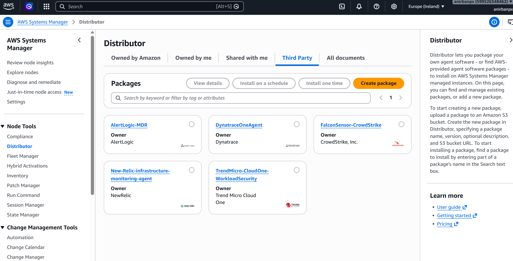

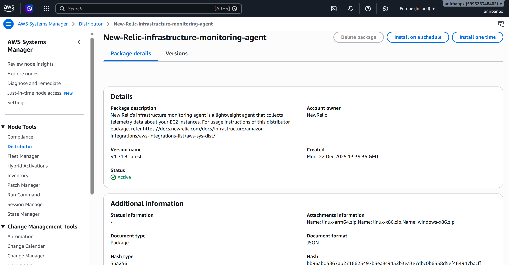


---

## 7. Competitive teardown

How New Relic, Datadog, and Dynatrace handle the sharpest friction points:

| Friction | New Relic | Datadog | Dynatrace |
|----------|-----------|---------|-----------|
| Process metrics default (A) | Off for automated installs; on for guided | Off, but surfaced as a named feature with a clear toggle | **On by default**, auto-discovers all processes (Smartscape) |
| APM silent no-op (B) | Silent without config; `validate-config` not prompted | Agent shows a warning in `datadog-agent status` | OneAgent instruments at the process level, no wrapper/ini |
| Alert "process is dead" (F) | Hand-author NRQL + loss-of-signal; naive `=0` stops evaluating | Process Check → pick from dropdown → set threshold | One toggle: "process group availability" |
| Cost transparency (G) | Off by default; cost not surfaced at decision point | Off by default; per-host cost on pricing page | On by default; per-host pricing removes the tradeoff |

New Relic's real edge is the **entity model** — the navigable process→host→service links that
OTel's dead string attributes can't match. Its real gap is **defaults and discoverability**.

---

## 8. Beyond the Big Three

The most useful signal for an *adoption* thesis comes from the newer entrants:

- **Netdata** — one command, per-process monitoring in ~60s, zero config, 400+ pre-built
  alerts. A direct rebuttal to frictions A–F: named processes *and* alerts are the default.
- **Coroot / Groundcover** — eBPF, auto service maps, no per-service config.
- **Causely** — causal AIOps; competes on answering *why* directly rather than 15 tool calls of
  guessing.

**The pattern:** traditional vendors sell more data and dashboards; the new wave sells *fewer
decisions* — zero-config, causal answers, auto-instrumentation. Adoption fails when tools push
configuration and query burden onto users. It's won by removing that burden.

---

## 9. Provoking faults and testing alerts

To know what alerts I needed, I had to manually kill the worker and watch. That's backwards. The
ideal loop: inject a known fault → observe what fired and what didn't → backtest the proposed
alert against the recorded window.

Today there's no native way to do this. "Send test notification" is **pipe testing** (does Slack
receive a message?), not **condition testing** (would this threshold actually fire?). The
streaming-gap footgun (F) would have been caught instantly by an alert-rehearsal mode; instead
it was invisible until I deliberately broke production.

**The opportunity:** an "alert rehearsal / fault drill" mode — inject a controlled fault,
evaluate all conditions against the resulting window, and show which fired, which were
suppressed, and which silently missed. It turns alert configuration from a guessing exercise
into a feedback loop.

---

## 10. Working backward: business journey → process

The default frame is "here are 62 processes sorted by CPU%, figure out which matter." The better
frame runs top-down: **business outcome → critical user journey → SLO → services in the path →
hosts → processes on those hosts.** The worker at 0.037% matters because checkout depends on it,
not because of its CPU rank. New Relic has Workloads and service maps but doesn't yet drive the
chain from the top — *declare your revenue-critical journey → auto-highlight the processes in its
path → watch those.* That makes "expected processes" far stronger when it's *derived* rather than
hand-declared.

---

## 11. Ideal user journey (to-be)

Same five-phase spine, friction removed:

1. **Onboard** — two clear tiers at the fork: CloudWatch (host metrics, no agent) vs. Host Agent
   (named processes + APM + logs), each showing what you get and don't, with a cost estimate.
2. **Install** — guided and SSM/IaC paths surfaced together; the generated config includes
   `enable_process_metrics`; startup diagnostics announce gaps ("0 process samples in 5 min —
   process metrics appear disabled").
3. **See processes** — Processes tab defaults to a business-criticality view (from Workloads /
   service maps), or prompts "which processes should always be running?" on first visit.
4. **Make it actionable** — "Expected Processes" generates the alert with loss-of-signal
   pre-configured; the `=0` footgun is never exposed. "Rehearse this alert" confirms it fires.
5. **Get notified** — the alert wizard won't complete without a destination or an explicit "set
   up later"; an account banner flags active conditions with zero destinations.

---

## 12. Proposed improvements (mapped to frictions)

| # | Improvement | Closes |
|---|-------------|--------|
| P1 | Default-on, cost-aware process metrics for automated installs | A, G |
| P2 | Loud-fail diagnostics on misconfigured agents (one stderr line / Setup-page nudge) | B, A |
| P3 | Install-aware health check: "agent running, no data flowing — here's the fix" | A, B, D |
| P4 | Expected Processes with journey-derived defaults | finding 7 |
| P5 | Loss-of-signal-aware process alerting as the default; footgun gated behind "Advanced" | F |
| P6 | Alert rehearsal / fault-drill mode | F5 |
| P7 | Scope disclosure at the onboarding fork (one sentence per path) | D |
| P8 | Bidirectional, always-visible process↔service link in the Processes tab | finding 6 |

The prototype mock (see the repository's mock artifacts) takes the highest-leverage of these —
a unified **"Process Coverage"** view that connects every process to its service, surfaces the
unmonitored and business-critical ones, and lets you watch them in one click with a gap-safe
alert auto-configured.

---

*All friction points above were reproduced on a live AWS deployment; screenshots are from the
real account. Telemetry was collected in parallel via the New Relic agents and an
OpenTelemetry + Prometheus/Grafana stack.*
